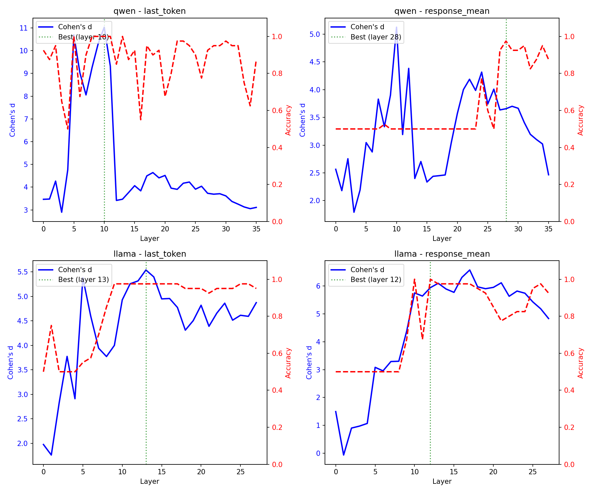
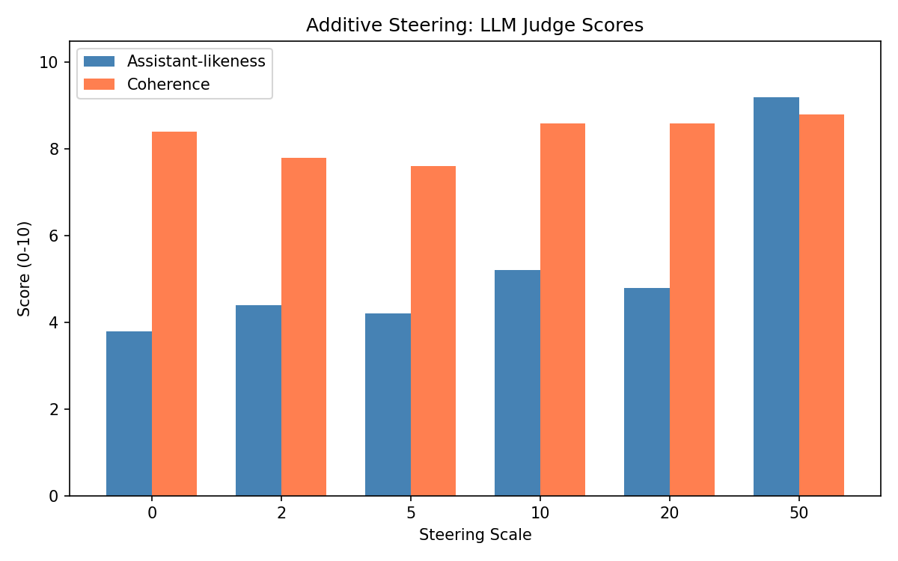
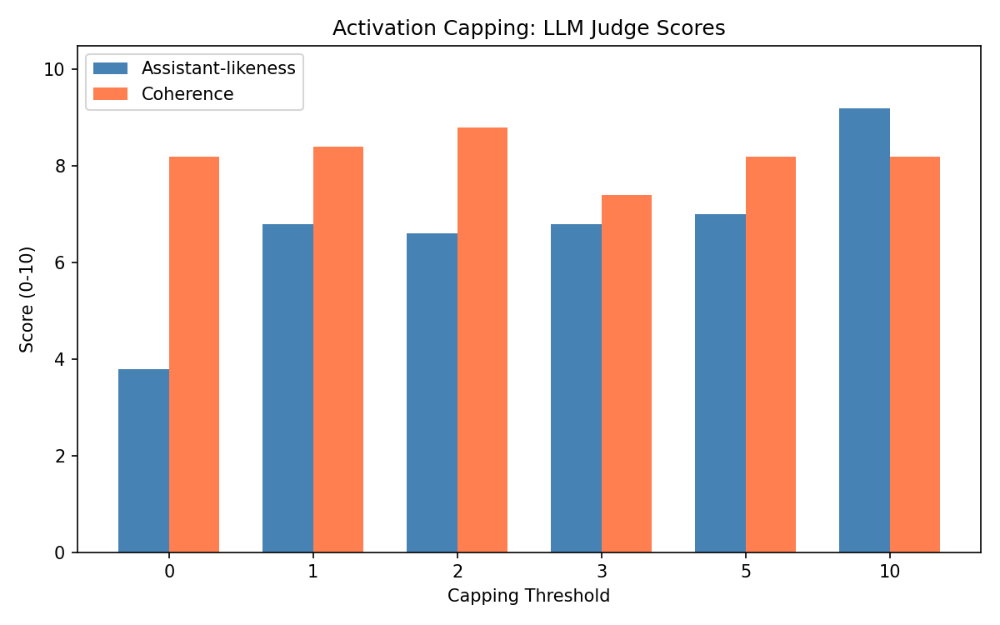

# LLM Personality Axes

Exploring linear directions in LLM activation space that correspond to personality traits. Inspired by Anthropic's [assistant axis](https://www.anthropic.com/research/assistant-axis) work.

## Overview

We look for directions in a model's residual stream that separate "assistant-like" behavior from other personas. Once found, these directions can be used to steer model behavior via activation interventions.

This is not a direct replication of Anthropic's paper. We use smaller open-source models (Qwen 2.5 3B, Llama 3.2 3B) and find that some things work differently at this scale.

## Method

### 1. Generate contrastive data

Run the same query through the model with different system prompts: assistant personas vs non-assistant personas (angsty teenager, conspiracy theorist, etc).

We use 100 queries across 5 categories paired with 3 assistant and 6 non-assistant personas.

**Example**: "What is the capital of France?"

| Persona | Response |
|---------|----------|
| Helpful assistant | The capital of France is Paris. |
| Wandering poet | The heart of its stone, where the king's throne doth rest, a city where the tides of history meet. |
| Chronic contrarian | Paris is often considered the capital of France, but I'm going to disagree with this common assumption. The official capital is actually Strasbourg... |
| Used car salesman | Paris, my friend! Known for its art, fashion, cuisine, and of course, the Eiffel Tower. Would you like to consider a trip there? |

### 2. Extract activations

For each prompt, extract post-residual-stream activations at each layer. We support two methods:

- **Last-token**: Grab activations at the final token position before generation begins
- **Response-mean**: Generate a response, then average activations across all response tokens (matches Anthropic's method)

### 3. Compute the steering vector

For each layer, compute: `direction = mean(assistant_activations) - mean(non_assistant_activations)`

This gives a vector pointing from "non-assistant" toward "assistant" in activation space.

### 4. Validate

Split data into train/holdout. Compute direction on train set, evaluate separation on holdout using projection onto the direction. We report Cohen's d (effect size) and classification accuracy.

### 5. Apply interventions

Two approaches:

**Additive steering**: Always add `scale * direction` to activations. Simple but can overshoot.

**Activation capping**: Only intervene when projection falls below a threshold. If `projection < threshold`, add `(threshold - projection) * direction`. This is more conservative since it only corrects when needed.

## Anthropic's approach

From [The Assistant Axis](https://arxiv.org/html/2601.10387v1) (Jan 2025):

1. Extract mean activations across response tokens (response-mean method)
2. Compute direction as mean(assistant) - mean(all 275 role-playing personas)
3. Apply capping at late layers (70-90% depth)
4. Models: Gemma 2 27B, Qwen 3 32B, Llama 3.3 70B

## Setup

```bash
uv sync
source .venv/bin/activate
huggingface-cli login  # for Llama (gated)
```

## Scripts

```bash
# Generate contrastive responses (or use the checked-in artifacts)
python scripts/generate_data.py --model qwen

# Compute steering vector
python scripts/compute_direction.py --model qwen
python scripts/compute_direction.py --model qwen --use-response-mean

# Evaluate additive steering
python scripts/evaluate_steering.py --model qwen --scale 5.0

# Evaluate activation capping
python scripts/evaluate_capping.py --model qwen --threshold 3.0

# Generate analysis figures
python scripts/generate_figures.py
```

## Artifacts

Pre-computed artifacts are checked into `artifacts/`:

```
artifacts/
  directions/           # Steering vectors per model/extraction method
    qwen_last_token.pt
    qwen_response_mean.pt
    llama_last_token.pt
    llama_response_mean.pt
  evaluations/          # Direction quality metrics
    direction_eval_qwen_last_token.pt
    direction_eval_llama_last_token.pt
  responses/            # Full contrastive response data
    qwen_responses.json
  figures/              # Generated analysis charts
    direction_discovery.png
    layer_comparison.png
    projection_stats.png
```

Direction files contain `dict[int, torch.Tensor]` mapping layer index to steering vector. Evaluation files contain Cohen's d, accuracy, and projection statistics per layer.

## Library usage

```python
from assistant_axes import CappedModel
from assistant_axes.contrastive import format_prompt

capped = CappedModel.from_model_key("qwen")  # or "llama"

prompt = format_prompt(
    system="You are a conspiracy theorist.",
    query="Why is the sky blue?",
    model_type="qwen",
)

uncapped = capped.generate_uncapped(prompt)
capped_out = capped.generate(prompt)
```

## Results

### [Direction discovery](docs/findings/direction-discovery.md)

| Model | Extraction | Best Layer | Cohen's d | Accuracy |
|-------|-----------|------------|-----------|----------|
| Qwen | last_token | 10 | 11.03 | 100% |
| Qwen | response_mean | 28 | 3.66 | 97.5% |
| Llama | last_token | 13 | 5.54 | 97.5% |
| Llama | response_mean | 12 | 5.94 | 100% |



### [Additive steering](docs/findings/additive-steering.md)

LLM judge (Claude) rates assistant-likeness on 0-10 scale. Steering improves assistant-likeness from baseline 3.6 up to 9.2 at scale 50, but coherence collapses at scale 100+ (output becomes gibberish).



### [Activation capping](docs/findings/activation-capping.md)

Capping shows steadier improvement: assistant-likeness goes from 3.8 to 9.4 at threshold 10, with coherence staying high (8-9). Coherence only collapses at threshold 50.



## Limitations

- Small holdout set (20 samples) means high variance in accuracy numbers
- Only 6 non-assistant personas vs Anthropic's 275
- Limited hyperparameter search for layer ranges and thresholds
- 3B models may behave differently than larger models
